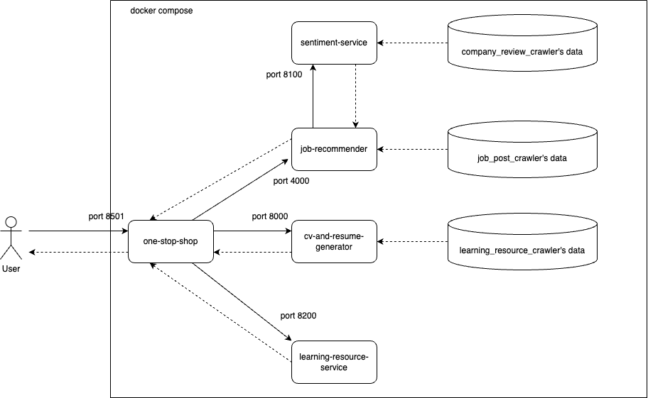
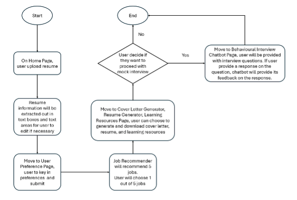

# CareerButterfly System
---

## Pre-requisite
* Docker desktop - https://www.docker.com/products/docker-desktop/
---

## Setup
* Navigate to project directory
  > ```cd SourceCode```
* Build docker images with docker compose
  > ```docker compose up```
* The image below illustrates the connected containers and volumes in the docker compose
  *  
* Navigate to url, `http://localhost:8501`, with browser
* The following diagram outlines the flow chart of using the application
  > 
---

## Environment variables
Each individual project may have one or more environment variables. The environment variables are hardcoded into their respective Dockerfile. The following are the environment variables that you may choose to change.
* cv_and_resume_generator
  * OPEN_AI_KEY
    > The api key from OpenAI. Change this if you wish to use your own api key.
* one_stop_shop
  * OPEN_AI_KEY
    > The api key from OpenAI. Change this if you wish to use your own api key.
---

## Volume mounts
Each container, created by docker-compose, may have a volume mount. The volume mount binds the data, that was created by the data collectors.
* sentiment_service
  * `DataCollection/company_review_crawler/data` is mounted to `/data`
* job-recommender
  * `DataCollection/job_post_crawler/data` is mounted to `/data`
* learning-resource-service
  * `DataCollection/learning_resource_crawler/data` is mounted to `/data`
