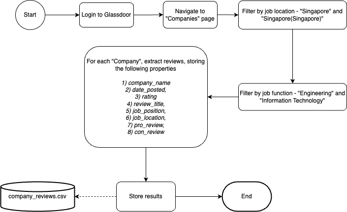
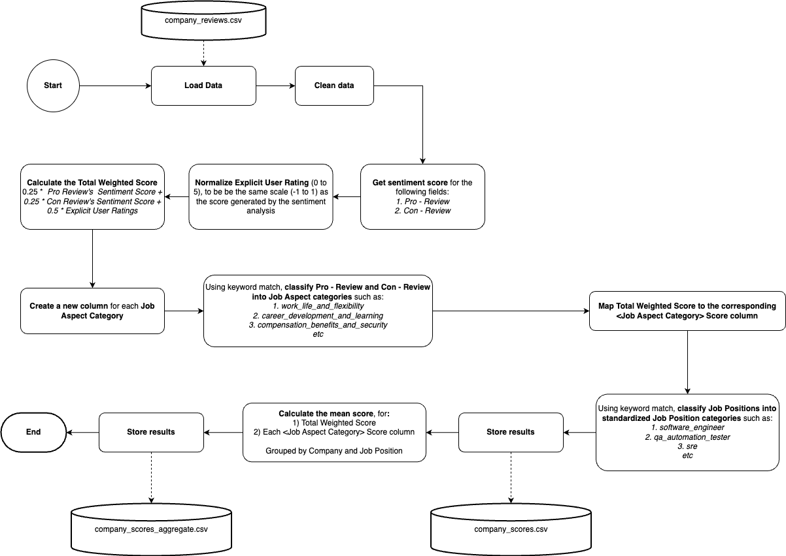
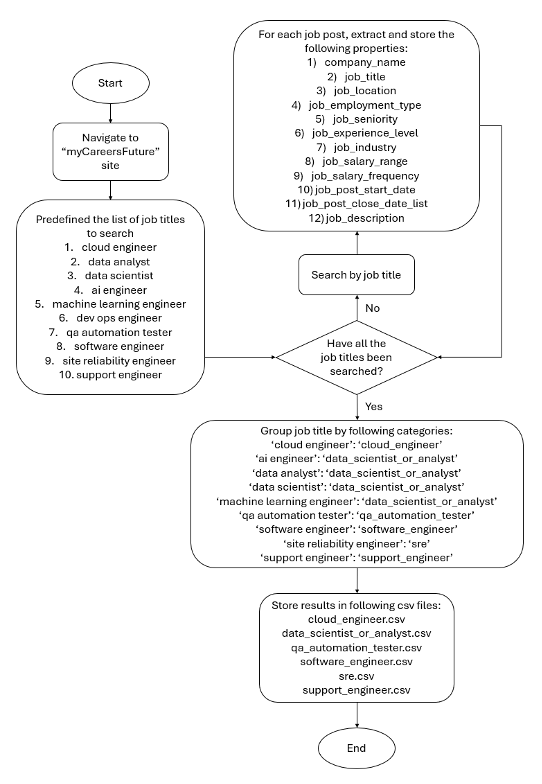

# Data Collection
---

## Pre-requisite
* Conda 23 - https://conda.io/projects/conda/en/latest/user-guide/getting-started.html
* Python 3 - https://www.python.org/downloads/
* Jupyter - https://jupyter.org/install
---

## Setup
### 1. Scraping company reviews
  * Navigate to project directory
    > ```cd SourceCode/DataCollection/company_review_crawler```
  * Create conda environment
    > ```conda env create -f environment.yml```
  * Activate conda environment
    > ```conda activate company_review_crawler```
  * Run all cells in `crawl_reviews.ipynb`
    * Note: Results will be saved in the `data` folder which will later be used in 
  * This diagram outlines the process of collecting company reviews
    * 

### 1.1. Rating company reviews
  * Run all cells in `company_reviews_sentiment.ipynb`
    * Note: Results will be saved in the `data` folder which will be used by `SourceCode/CareerButterflySystem/sentiment_service`
  * This diagram outlines the process of rating company reviews
    * 

### 2. Scraping job posts
  * Navigate to project directory
    > ```cd SourceCode/DataCollection/job_post_crawler```
  * Create conda environment
    > ```conda create --name job_post_crawler python=3.10```
  * Activate conda environment
    > ```conda activate job_post_crawler```
  * Install python dependencies
    > ```pip install -r requirements.txt```
  * Create 2 folders and rename them as "new_data" and "data" respectively
    * Note: Ignore this step if folders already exist
  * Run `data_collection_job_information.py`
    > ```python data_collection_job_information.py```
    * Results will be saved in the `new_data` folder which will be used by later in
  * Run `rename_files.py`
    > ```python rename_files.py```
    * Results will be saved in the `data` folder which will be used by `SourceCode/CareerButterflySystem/job_recommender`
  * This diagram outlines the process of collecting job posts
    *  

### 3. Scraping learning resources
  * Navigate to project directory
    > ```cd SourceCode/DataCollection/learning_resource_crawler```
  * Create conda environment
    > ```conda env create -f environment.yml```
  * Activate conda environment
    > ```conda activate learning_resource_crawler```
  * Run all cells in `leetcode.ipynb`
    * Note: Results will be saved in the `data` folder which will later be used in `SourceCode/CareerButterflySystem/learning_resource_service`
  * Run all cells in `copilot query1.ipynb`
    * Note: Results will be saved in the `data` folder which will later be used in `SourceCode/CareerButterflySystem/learning_resource_service`
  * Run all cells in `CareerFuture Job Description And Tag Scraper.ipynb`
    * Note: Results will be saved in the `data` folder which will later be used in `SourceCode/CareerButterflySystem/learning_resource_service`
  * This diagram outlines the process of collecting for the skill learning resources
    * 
  * This diagram outlines the process of collecting for the leetcode learning resources
    * 
